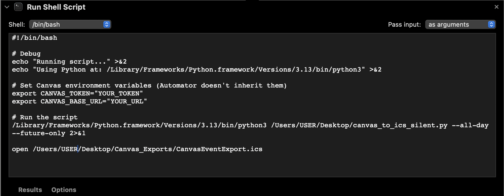

# ical-canvas-event-import-tool
User runs a Python Script wrapped in an Apple Automator Application utilizing a Canvas API Key to port over all future assignments from their Canvas (LMS) Account into iCal as full-day events (meant to be used as an assignment tracker, of what is done and what is not), which is run silently in the background without needless Terminal Windows or Python Popups.

This tool is built to be used on Mac with iCal, and is not adapted specifically for any other calendar tool. I do not currently have the time or ability to update this repo to support new platforms, but you are of course free to do so.

---

## **Step-by-Step Instructions:**

**Step 1:** **Install Python 3.9+**. You may find the download for MacOS [***here***](https://www.python.org/downloads/). No extra configuration needs to be done right off the bat.

**Step 2:** Save the python file to your _Desktop_ as `canvas_to_ics_silent.py`, and the shell file as `run_canvas_silent.sh` and note the file paths, as your will need them later. EX: /Users/**USER**/Desktop/canvas_to_ics_silent.py

**Step 3:** Create a Canvas access token (Profile → Settings → New Access Token). Keep it private. Once you leave the page the token cannot be retrieved for security purposes, so make sure to write it down.

**Step 4:** Set environment variables: Open `run_canvas_silent.sh` in a text editor of your choice. Inside the shell script, locate the environment variables `CANVAS_BASE_URL` and `CANVAS_TOKEN` and fill the fields in with YOUR institution's base URL and your Canvas Access Token from earlier.

    CANVAS_BASE_URL="https://canvas.mit.edu"
    CANVAS_TOKEN="YOUR_TOKEN_HERE"

Also, you will have to do something similar with the `.py` file. Open it in a text editor, find line 77, and change the url to whatever your institution's url is **without the https://**.

    event.add('uid', f"{a.get('id')}_{course.get('id')}@canvas.mit.edu")

**Step 5:** Make the `.sh` file executable. In MacOS Terminal, paste and run:

    chmod +x ~/Desktop/run_canvas_export.sh
This will make your `.sh` file executable and able to be run by our Automator Wrapper.

**Step 6:** Wrap the Python Script in an Automator App (creates executable `.app` file to easily run program):

Open Automator on your Mac and create a new project. Add a **Run Shell Script** block and configure it to look like the below image. (code for the inside of the block can be found as a seperate .txt file in the repository)

Before using this tool, you must change the TOKEN, URL, and USER fields within that code to fit your usage.

Finally, you are going to save your project to your desktop as an Application, which will allow it to run easily with a single double-click.

---

### Disclaimer  
This project was developed with the assistance of generative AI tools.  

The software is provided "as is", without warranty of any kind, express or implied, including but not limited to the warranties of merchantability, fitness for a particular purpose, and noninfringement. In no event shall the author(s) be liable for any claim, damages, or other liability, whether in an action of contract, tort, or otherwise, arising from, out of, or in connection with the software or the use or other dealings in the software.  
